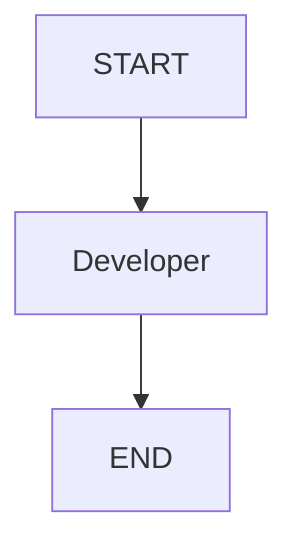

# Graphs

**Problem statement**

    Write a simple graph that counts the number of times a developer has been invoked.
    The state contains a single variable "count". And a single node that increments the count.

<div align="center">

`count` : `0` $\rightarrow$ `1` $\rightarrow$ `2` $\rightarrow$ `3` $\rightarrow$ `4` $\rightarrow$ $\dots$

</div>

**Explanation**

This example demonstrates a simple graph execution using a `GraphState` and a single `Developer` node.
As shown in the graph below, the `Developer` node is the only node in the graph.

<div align="center">



</div>


*State implementation*:

To implement the state we will use a `TypeDict` with a single key, "count", starting at 0.
To define this the following code is used:


````python
class GraphState(TypedDict):
    count: int
``````

*Node implementation*:

To implement the `Developer` node, we define a function called `developer`, that receives the state as an argument and increments the "count" by 1 and returns the updated state.

```python
def developer(state : GraphState):
    state["count"] += 1
    return state
```

*Graph implementation*:

The function `build_graph` creates a `StateGraph` and adds the `Developer` node to it.
The `GraphState` is passed as the first argument to the `StateGraph` constructor.
The `add_node` method is used to add the `Developer` node to the graph. Finally 
the memory checkpointer is added to the graph.

```python
def build_graph():

    builder = StateGraph(GraphState)
    builder.add_node("developer", developer)
    builder.add_edge(START, "developer")
    builder.add_edge("developer", END)

    memory = MemorySaver()
    graph = builder.compile(checkpointer=memory)

    return graph
```


**Resources**
1. https://langchain-ai.github.io/langgraph/concepts/low_level/#graphs
2. https://langchain-ai.github.io/langgraph/concepts/low_level/#stategraph
3. https://langchain-ai.github.io/langgraph/concepts/low_level/#state
